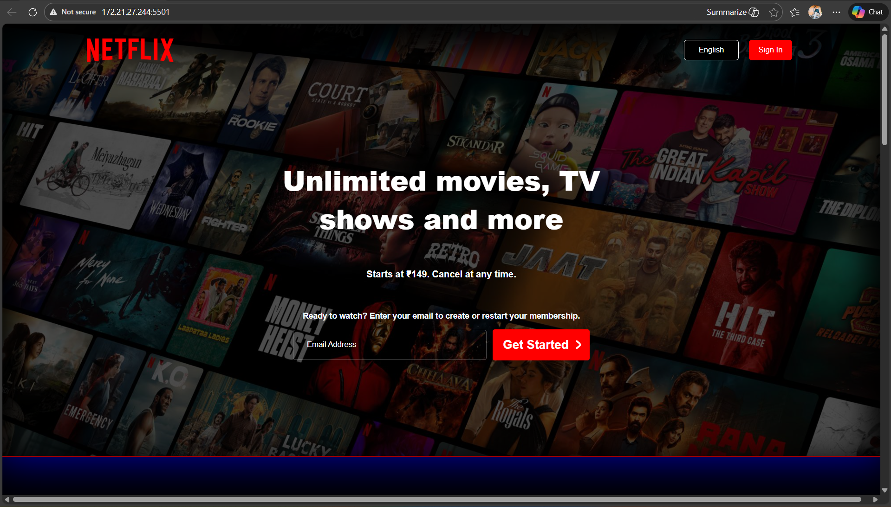
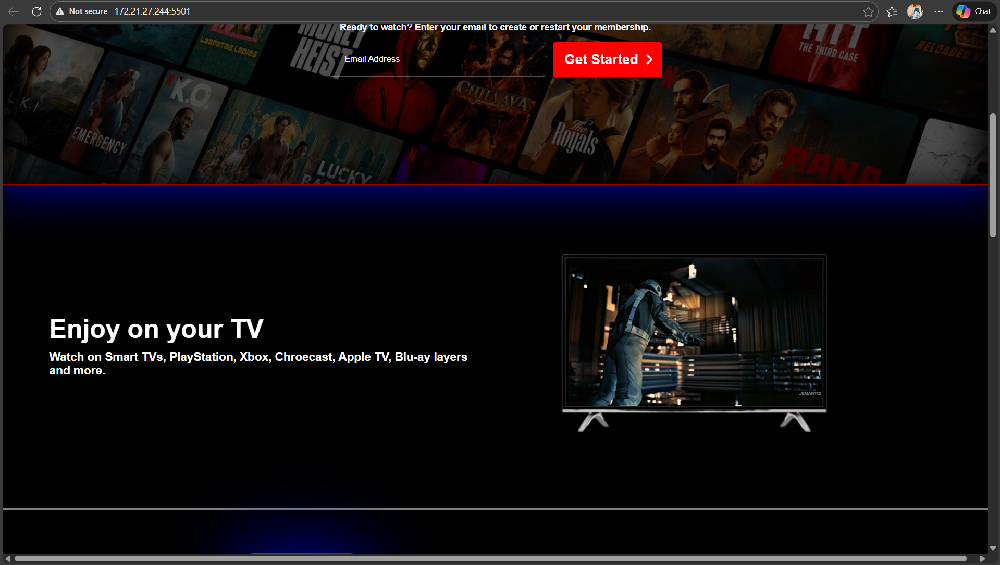
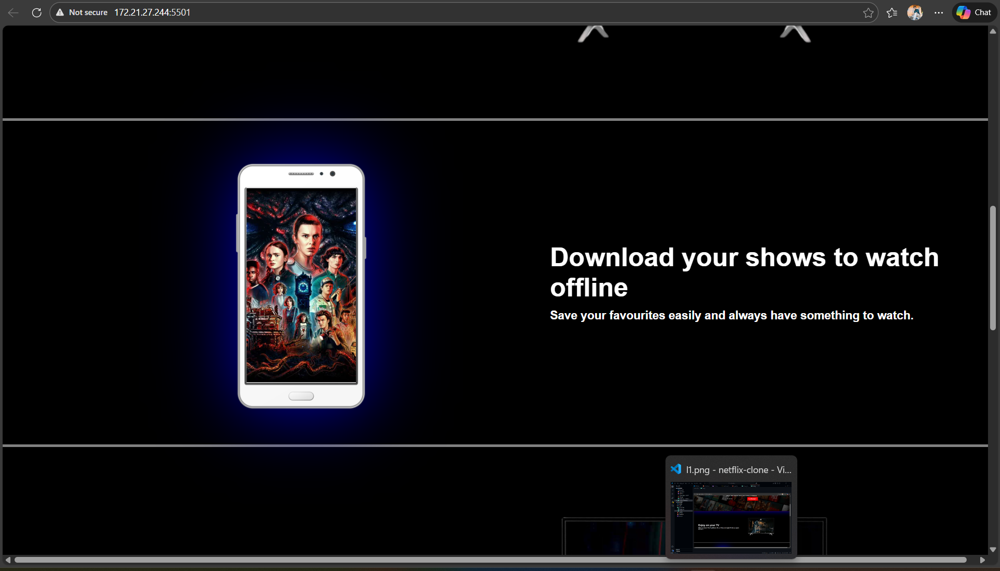
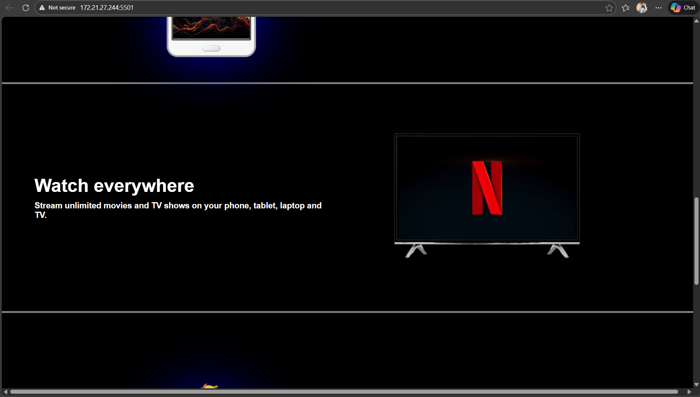
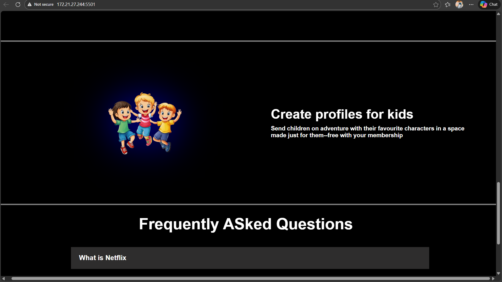
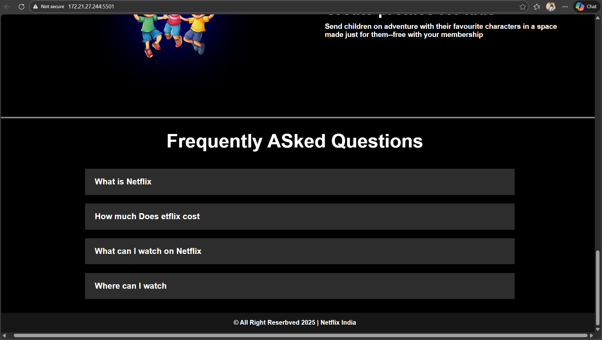

# 🎬 Netflix Clone (HTML & CSS)

A responsive **Netflix homepage clone** built using **HTML5 and CSS3** as part of my frontend learning journey.  
This project focuses on layout design, responsiveness, and real-world UI cloning.

> ⚠️ **Disclaimer:**  
> This project is created **only for educational purposes**.  
> Netflix is a registered trademark, and this project is **not affiliated with or endorsed by Netflix**.

---

## 🌐 Live Demo

🎥 Demo Video: https://www.youtube.com/watch?v=Zuhr7NPZpLY <br>
🔗 Live Website: https://student-sayan75.github.io/Netflix-UI-clone/

---

## 📸 Preview








---

## ✨ Features

- Responsive Netflix-style UI
- Clean and modern layout
- Background overlay effects
- Embedded videos inside mock devices
- Mobile, tablet, and desktop friendly
- Media queries for different screen sizes

---

## 🛠️ Tech Stack

- **HTML5**
- **CSS3**
  - Flexbox
  - Media Queries
  - Positioning
  - Responsive Design

---

## 📂 Project Structure

```
Netflix-Clone/
│
├── index.html
├── style.css
├── assets/
│ ├── bg.jpg
│ ├── netflixlogo.png
│ ├── tv.png
│ ├── phone.png
│ ├── child.png
│ ├── vid.mp4
│ └── video2.mp4
├── Screenshots/
└── README.md
```

## 🚀 How to Run Locally

1. Clone the repository
   ```bash
   git clone https://github.com/your-username/netflix-clone.git
   ```

---

## 📚 What I Learned

- Structuring HTML for large layouts
- CSS Flexbox for alignment
- Absolute & relative positioning
- Responsive design using media queries
- Real-world UI cloning techniques

---

## 🧠 Future Improvements

- Add JavaScript for FAQ toggle
- Improve accessibility (ARIA labels)
- Add animations and hover effects
- Convert the project to React in the future

---

## 🤝 Connect With Me

- **GitHub:** https://github.com/student-Sayan75
- **YouTube:** https://www.youtube.com/channel/UCbKKHt1DEGntiDRaa-jQD_w
- **LinkedIn:** https://www.linkedin.com/in/sayan-ali-mallick-1238832a5/
